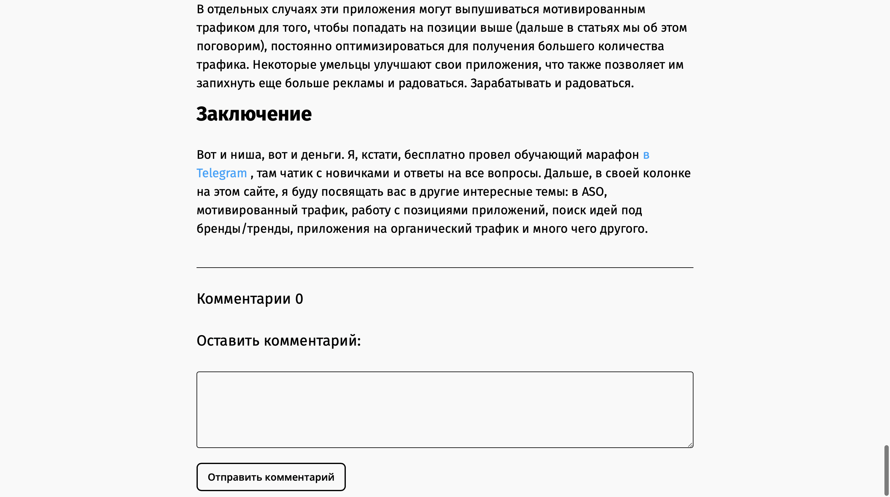
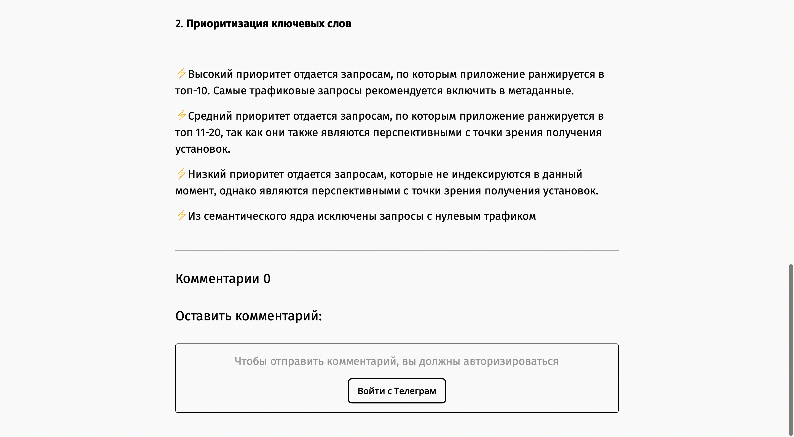
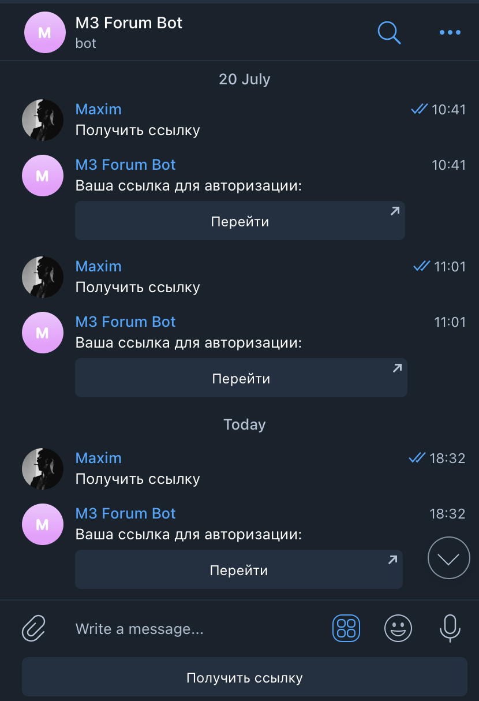
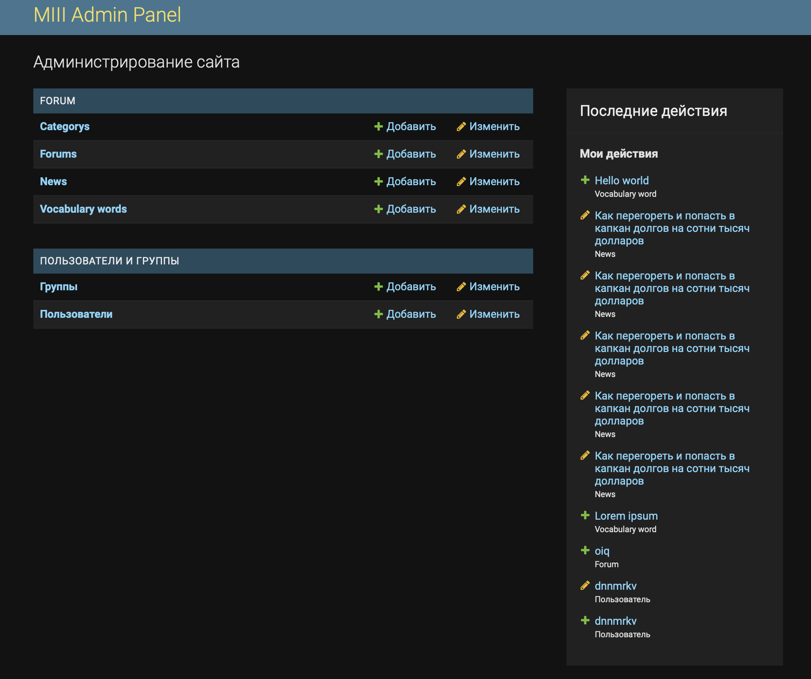

<h1 align="center">M3_website</h1>

<h2>:open_book: Description</h2>

M3 is a Ukrainian IT company that develops mobile games and this web service was developed for this company.

The service is a news website of M3 company, with elements of a web forum (there is the possibility of communication / commenting between users of the site), as well as the possibility of administration.

<h2>More about each function</h2>

<h3>:speaking_head: Communication</h3>

The site contains forum elements, as site users have the opportunity to leave comments / reply to comments under each of the news on the site.

</img>

Communication on the website is available only if the user has authorized. Otherwise, you may see this message.

</img>

<h3>:key: Authorization</h3>

The Authorization works by a special bot in the Telegram messenger. User enough to generate a individual link and follow by it. After that, user will come back on the website already authorized.

</img>

<h3>:hammer_and_wrench: Administration</h3>

</img>

M3 website have own admin panel for interact with the data which contain site. Web resource administration features include:

<ul>
<li>Generating news</li>
<li>Editing news</li>
<li>Deleting news</li>
<li>Editing user's comments</li>
<li>Deleting user's comments</li>
</ul>

